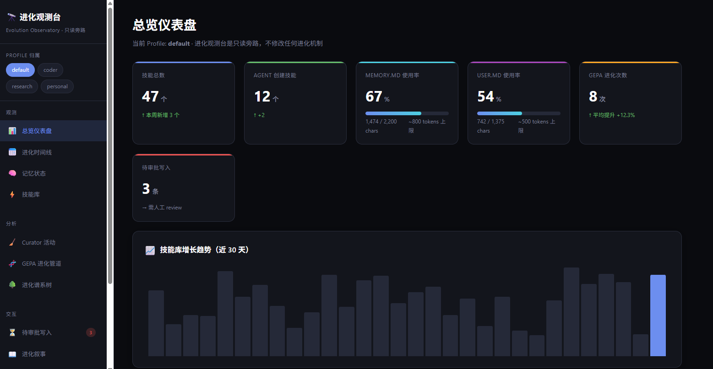
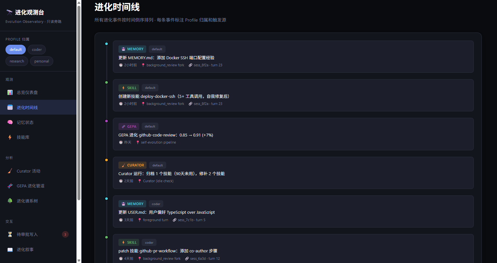
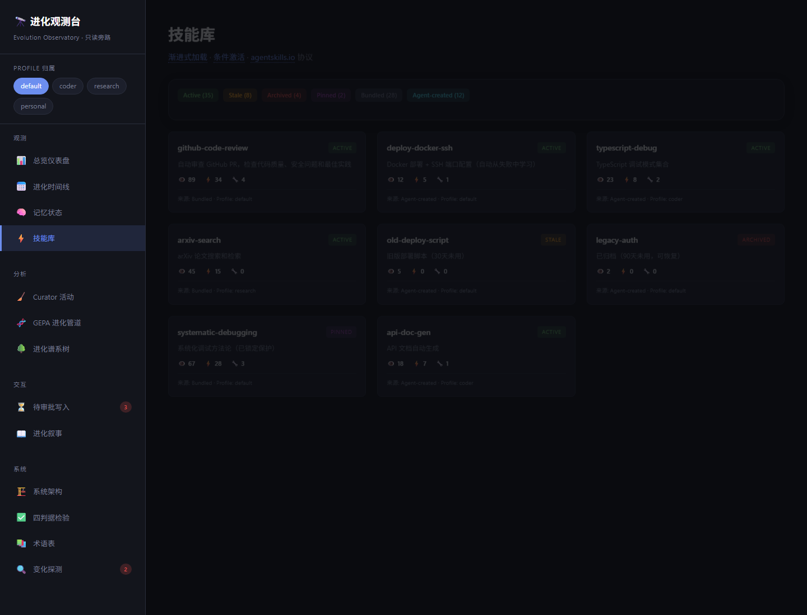
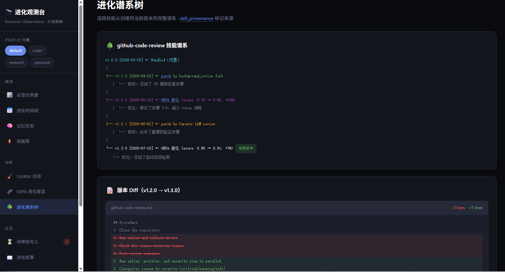

<div align="right">

[🇨🇳 中文](README.md) · 🇺🇸 English

</div>

# Hermes Evolution Observatory

> Bring every single self-evolution step of Hermes Agent **out of the black box**.
>
> **Observable · Traceable · Explainable · Interruptible · Rollback-able.**

[]()
[]()
[]()
[]()

---

## 💡 The Problem

[**Hermes Agent**](https://hermes-agent.nousresearch.com) is an open-source AI agent framework from Nous Research. Unlike traditional agents, **it evolves itself**:

- **memory** continuously updates long-term memory (`MEMORY.md` / `USER.md`)
- **skill_manage** lets the agent create, patch, and archive its own "skills"
- **curator** periodically consolidates the skill library and archives dormant skills
- **GEPA / DSPy** uses genetic algorithms to optimize skill prompts offline
- **background_review** does retrospective analysis, distilling successful patterns into new skills
- **Checkpoints** auto-snapshots before every mutation

These mechanisms run silently and evolve independently — **and that's exactly the problem**:

> 🔒 **Evolution happens inside a black box. Users can't see it, understand it, intervene in it, or roll it back.**

- ❓ What did the agent learn today? Which new skills did it create? Why?
- ❓ I clearly remember skill X was in the library yesterday — where did it go? Who archived it?
- ❓ MEMORY.md was updated again — what was added? What was overwritten?
- ❓ Did the latest GEPA run make the skill better or worse? How do I roll back?
- ❓ The agent quietly writes sensitive content into memory — how do I intercept?

## 🎯 What This Does

**Make evolution visible.**

Five capabilities, one per user pain-point above:

| Capability | What it delivers |
|---|---|
| 👁 **Observable** | 8 read-only collectors scan real Hermes data sources, aggregating events scattered across `~/.hermes/**` into timelines, lineage trees, and status cards |
| 🔍 **Traceable** | Complete lineage of every skill from v1.0 to current; session/turn provenance for each memory mutation; click through to the original context |
| 📖 **Explainable** | Every evolution event is labeled with its **trigger source** (foreground / background_review / Curator / GEPA) — no more "it just changed" |
| ✋ **Interruptible** | Sensitive/suspicious writes go into a pending-approval queue; users approve or reject manually; the agent can't bypass |
| ⏪ **Rollback-able** | Checkpoints auto-snapshot before every patch/edit; you can "go back to that moment" any time — diff view + one-click rollback |

## ⚙️ 4 Design Principles

| Principle | Meaning |
|---|---|
| 🔒 **Read-only sidecar** | Never mutates Hermes data. Any write attempt is rejected. Observatory crashes never affect the agent |
| 📸 **Real data only** | No sample tables, fake data, or placeholders. Every number, timeline, and lineage comes from real `~/.hermes/**` |
| ⚡ **Sub-second UX** | First-paint < 1s. Slow collectors are backgrounded and cached; endpoints cached 10–60s |
| 🧩 **Zero-build deploy** | Backend: one `python main.py`. Frontend: single HTML file. No npm/webpack needed |

## 🚀 Typical Use Cases

**End users**:

- 🕐 **Daily review** — open the evolution timeline, see what memories/skills were added or patched today/this week
- 🔍 **Anomaly hunting** — noticed odd agent behavior? Locate the exact patch in the lineage tree that introduced it
- 📊 **Quota monitoring** — MEMORY.md/USER.md usage dashboard, early-warns when approaching limits
- 🧹 **Decision review** — what did Curator archive/merge, and why? Roll back if you disagree
- ✋ **Threat interception** — prompt injections, secret leakage, etc. queue up for manual approve/reject

**Developers / researchers**:

- 📈 **Measurable evolution velocity** — count patches/GEPA runs per skill from v1.0 to current, track score deltas
- 🧬 **GEPA Pareto frontier visualization** — multi-objective candidate distributions at a glance
- 🔀 **Cross-profile aggregation** — running multiple agent profiles (coder/research/personal)? Events merge into one timeline
- 🌳 **Lineage forensics** — pinpoint which session an agent-created skill originated in; click to jump back to source session
- 🔄 **Schema drift detection** — automatic detection of Hermes internal schema changes (no more "upstream renamed a field, the collector silently broke")

## 📐 Three-Layer Architecture

1. **Collect**: 8 read-only collectors scan real Hermes data sources (`~/.hermes/**`), never mutate
2. **Weave**: memory mutations, skill create/patch, curator archives, checkpoint snapshots — all events are weaved by time / skill / profile into timelines and version trees
3. **Present**: single-file SPA frontend, 12 views, real-diff expansion for versions

## Screenshots

> The images below are from the actual running interface (click to zoom). There's also an **interactive prototype with fully-populated demo data** 👇

<div align="center">
  <a href="https://luoxiangcai.github.io/hermes_evolution-observatory/demo.html" target="_blank">
    
  </a>
  <br>
  <sub>💡 All data (47 skills, 8 GEPA runs, 3 pending approvals, etc.) is pre-populated demo data — fully interactive</sub>
</div>

<br>

<table>
  <tr>
    <td align="center"><b>Overview · Dashboard</b></td>
    <td align="center"><b>Evolution Timeline</b></td>
  </tr>
  <tr>
    <td></td>
    <td></td>
  </tr>
  <tr>
    <td align="center"><b>Skill Library</b></td>
    <td align="center"><b>Evolution Lineage Tree</b></td>
  </tr>
  <tr>
    <td></td>
    <td></td>
  </tr>
</table>

---

## Quick Start

### 1. Install

```bash
git clone https://github.com/luoxiangcai/hermes_evolution-observatory.git
cd hermes_evolution-observatory

# Use uv (recommended) or python -m venv
uv venv --seed .venv
.venv/bin/pip install -r requirements.txt
```

### 2. Run

```bash
.venv/bin/python backend/main.py
# Open http://127.0.0.1:9120/
```

Or use a systemd user service (recommended on Linux/WSL — see [Deployment](#deployment)).

### 3. Install Plugin Hook (optional but strongly recommended)

The hook records `memory` / `skill_manage` / `skill_view` calls **in real time** as events, giving the "Evolution Timeline" and "Lineage Tree" real data.

```bash
# hermes_rd is your Hermes profile name — change to your actual one
PROFILE=hermes_rd

# Symlink for hot-reload development
mkdir -p ~/.hermes/profiles/$PROFILE/plugins/
ln -sf "$(pwd)/plugins/evolution-observatory-hook" \
       ~/.hermes/profiles/$PROFILE/plugins/

# Enable
hermes plugins enable evolution-observatory-hook
```

> The hook uses Hermes's `pre_tool` / `post_tool` / `on_session_*` lifecycle. **New sessions only** — the current session isn't retroactively captured.

## Project Structure

```
evolution-observatory/
├── README.md            · you're reading it (Chinese)
├── README.en.md         · English version
├── LICENSE              · MIT
├── CHANGELOG.md         · changelog
├── requirements.txt     · Python dependencies
├── Makefile             · install / run / test / dev
│
├── backend/             · FastAPI backend
│   ├── main.py          · single-file entry · 22 API routes · WebSocket · static mount
│   ├── config.py        · port/host/Hermes path resolution
│   ├── schema_registry.py · schema versioning + drift detection
│   ├── narrative_generator.py · evolution narrative generator
│   └── collectors/      · 8 read-only collectors
│       ├── base.py      · BaseCollector abstract class
│       ├── memory.py    · MEMORY.md / USER.md
│       ├── skills.py    · SKILL.md + .usage.json
│       ├── curator.py   · curator/*.jsonl
│       ├── gepa.py      · GEPA metrics
│       ├── pending.py   · pending approval writes
│       ├── events.py    · evolution-events.jsonl (cross-profile aggregation)
│       ├── state_db.py  · SQLite / FTS5
│       └── checkpoints.py · SKILL.md snapshots + diff
│
├── frontend/
│   └── index.html       · 1800+ line single-file SPA, zero-build, 12 views
│
├── plugins/
│   └── evolution-observatory-hook/
│       ├── plugin.yaml
│       └── handler.py   · pre_tool / post_tool hooks
│
├── tests/               · 17 test cases, all passing
└── docs/
    ├── DESIGN.md        · design doc (positioning, 4 criteria, drift detection, views)
    └── IMPLEMENTATION.md · implementation doc (API, collector interface, deployment)
```

## Data Model

**Never mutates Hermes data.** The observatory reads from these locations:

| Collector | What it reads | Notes |
|---|---|---|
| `memory` | `<home>/memories/MEMORY.md`, `USER.md` | Paragraph parsing + usage stats |
| `skills` | `<home>/skills/**/SKILL.md`, `.usage.json` | Frontmatter parsed with PyYAML |
| `curator` | `<home>/logs/curator/*.jsonl` | One entry per curator run |
| `gepa` | `<home>/gepa/**` | Scores, Pareto |
| `pending` | `<home>/pending/*` | Writes awaiting user approval |
| `events` | `<home>/logs/evolution-events.jsonl` | Appended by Plugin Hook |
| `state_db` | `<home>/state.db` (SQLite) | Session/turn metadata |
| `checkpoints` | `<home>/skills/.checkpoints/<name>/*.md` | SKILL.md snapshots before patch |

`<home>` = current profile home. Default profile → `~/.hermes`; other profiles → `~/.hermes/profiles/<name>/`.

## Configuration

| Env var | Default | Description |
|---|---|---|
| `OBS_HOST` | `127.0.0.1` | Listen address |
| `OBS_PORT` | `9120` | Listen port |
| `HERMES_HOME` | `~/.hermes` | Hermes data root (can also point to `~/.hermes/profiles/<name>`) |
| `HERMES_DASHBOARD_URL` | `http://127.0.0.1:9119` | Hermes Dashboard (for `/api/status` and drift detection) |
| `OBS_COLLECT_INTERVAL` | `60` | Collection interval (seconds) |
| `OBS_DRIFT_INTERVAL` | `3600` | Drift detection interval (seconds) |

## Deployment

### systemd user service (Linux/WSL, recommended)

```ini
# ~/.config/systemd/user/evolution-observatory.service
[Unit]
Description=Hermes Evolution Observatory
After=network-online.target
Wants=network-online.target

[Service]
Type=simple
WorkingDirectory=%h/path/to/evolution-observatory/backend
ExecStart=%h/path/to/evolution-observatory/.venv/bin/python main.py
Restart=on-failure
RestartSec=5
StandardOutput=append:%h/path/to/evolution-observatory/logs/observatory-systemd.log
StandardError=append:%h/path/to/evolution-observatory/logs/observatory-systemd.log

[Install]
WantedBy=default.target
```

Enable:

```bash
systemctl --user daemon-reload
systemctl --user enable --now evolution-observatory
loginctl enable-linger $USER   # WSL / headless-login scenarios
```

## Tests

```bash
.venv/bin/pytest tests/ -q
# 17 passed
```

## Development

```bash
# Full-stack, hot-reload on code changes
.venv/bin/uvicorn backend.main:app --reload --host 127.0.0.1 --port 9120
```

- Backend: `backend/main.py` is the single entry point; changing collectors or API endpoints triggers uvicorn auto-reload
- Frontend: `frontend/index.html` is a single-file SPA; edit, then Ctrl+F5 to hard-refresh
- Tests: when adding a new collector, mirror the assertion in `tests/test_registry.py`

## Known Limitations

- **Hermes private hook API**: `plugins/evolution-observatory-hook/` depends on Hermes's `register_hook("pre_tool", ...)` API. If Hermes changes the API, the handler needs adjustment.
- **Cross-profile aggregation**: the observatory defaults to `all_profiles=true`, merging events from all profiles. To filter by profile, use the profile pill toggle in the frontend.
- **Chinese docs**: core docs are currently in Chinese. English PRs welcome.
- **No auth**: defaults to `127.0.0.1`, local-only. To expose externally, put a reverse proxy + auth in front.

## Tech Stack

- **Backend**: Python 3.10+ · FastAPI · uvicorn · httpx · PyYAML
- **Frontend**: pure HTML/CSS/JavaScript · no build · no framework
- **Tests**: pytest · pytest-asyncio

## Contributing

Issues and PRs welcome. Before submitting:

1. Run `pytest tests/`, all 17 cases must pass
2. New collectors must ship with a graceful-degradation test (returns `status: "unavailable"` when data source is missing, doesn't crash)
3. Frontend changes: verify manually with Ctrl+F5

## License

[MIT](LICENSE) © 2026 luoxiangcai
